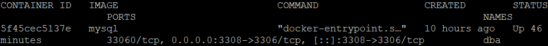
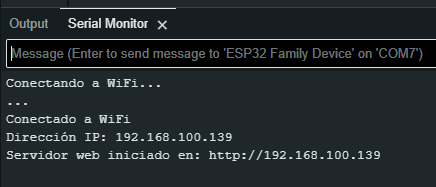

# Proyecto Satélite Terrestre para Análisis. Satelite-Terra v1

Este proyecto consiste en un sistema de monitoreo ambiental que utiliza sensores para recolectar datos como temperatura, humedad, humedad del suelo y radiación UV. Los datos son enviados a una base de datos MySQL a través de un servidor Node.js, y pueden ser visualizados en una interfaz web.

Programas usados: Docker, Node.js, Arduino Idle, Datagrip, Putty (servidor), Postman (pruebas de api), VS Code.

## Materiales Necesarios

- **ESP32**: Microcontrolador con WiFi integrado.
  - [Comprar en Aliexpress](https://es.aliexpress.com/item/1005007205044247.html?spm=a2g0o.productlist.main.5.57cf72b2mg31xQ&algo_pvid=87659b11-ec04-4ffc-ac20-94f563565ee4&pdp_ext_f=%7B%22order%22%3A%221090%22%2C%22eval%22%3A%221%22%7D&utparam-url=scene%3Asearch%7Cquery_from%3A)
  
- **Sensor DHT22**: Sensor de temperatura y humedad.
  - [Comprar en Aliexpress](https://es.aliexpress.com/item/1005007171350003.html?spm=a2g0o.productlist.main.13.219fPSqKPSqKfn&algo_pvid=a1f80de2-facd-407e-8010-b9f2bd8e305c&pdp_ext_f=%7B%22order%22%3A%221487%22%2C%22eval%22%3A%221%22%2C%22orig_sl_item_id%22%3A%221005007171350003%22%2C%22orig_item_id%22%3A%221005006953306942%22%7D&utparam-url=scene%3Asearch%7Cquery_from%3A)
  
- **Sensor HW837/S12SD**: Sensor de radiación UV.
  - [Comprar en Aliexpress](https://es.aliexpress.com/item/1005006947917783.html?spm=a2g0o.productlist.main.5.34ff2acfOPnbBa&algo_pvid=3d116449-c3c2-4917-9ecf-a9a2b2c370fd&pdp_ext_f=%7B%22order%22%3A%2230%22%2C%22eval%22%3A%221%22%7D&utparam-url=scene%3Asearch%7Cquery_from%3A)
  
- **Sensor de Humedad del Suelo**: Sensor para medir la humedad del suelo.
  - [Comprar en Aliexpress](https://es.aliexpress.com/item/1005005202930632.html?spm=a2g0o.productlist.main.5.166a7fccBc9tqr&algo_pvid=7cb4208f-daa0-45dd-a04e-a5e1c7facd04&pdp_ext_f=%7B%22order%22%3A%22611%22%2C%22eval%22%3A%221%22%7D&utparam-url=scene%3Asearch%7Cquery_from%3A)

  

## Lógica del Proyecto

1. **Lectura de Sensores**: El ESP32 lee los datos de los sensores DHT22 (temperatura y humedad), HW837 (radiación UV) y el sensor de humedad del suelo.
2. **Envío de Datos**: Los datos recolectados son enviados cada 30 minutos a un servidor Node.js mediante una solicitud HTTP POST.
3. **Almacenamiento en Base de Datos**: El servidor Node.js recibe los datos y los almacena en una base de datos MySQL.
4. **Visualización Web**: Los datos pueden ser visualizados en una interfaz web que muestra los últimos valores recolectados y el estado de la base de datos.

## Modelo de Programación

- **Arduino (C++)**: El código en `sat.ino` se ejecuta en el ESP32 y maneja la lectura de los sensores y el envío de datos al servidor.
- **Node.js (JavaScript)**: El servidor en `server.js` maneja la recepción de datos y su almacenamiento en la base de datos MySQL.
- **MySQL**: La base de datos almacena los datos recolectados por los sensores. Esta se recomienda crear en un contenedor de Docker separado del servidor de node.

## Usos

Este proyecto fue ideado como un satélite terrestre para el análisis de datos ambientales. Puede ser utilizado en:

- **Agricultura**: Monitoreo de condiciones del suelo y clima para optimizar el riego y el cuidado de cultivos.
- **Investigación Ambiental**: Recolección de datos para estudios climáticos y de calidad del aire.
- **Educación**: Herramienta didáctica para enseñar sobre IoT, programación y análisis de datos.

## Instalación y Configuración

1. **Cargar el Código en el ESP32**: Usa el IDE de Arduino para cargar el código `sat.ino` en el ESP32.
2. **Configurar el Servidor Node.js**: Instala Node.js y las dependencias necesarias (`express`, `mysql2`, `body-parser`, `cors`) y ejecuta el servidor con `node server.js`.
3. **Configurar la Base de Datos MySQL**: Crea la base de datos `sat_dba` y la tabla `sensores` usando el script `dba.sql`.

La ip se puede tomar directo de la terminal del arduino. 

## Contribuciones

Si deseas contribuir a este proyecto, por favor abre un issue o envía un pull request en el repositorio de GitHub.

## Proximos pasos

Espero seguir con este satelite terrestre con las modulos y sensores, ademas de poder lograr autonomia con paneles solares. El tiempo lo dirá. 🦖
